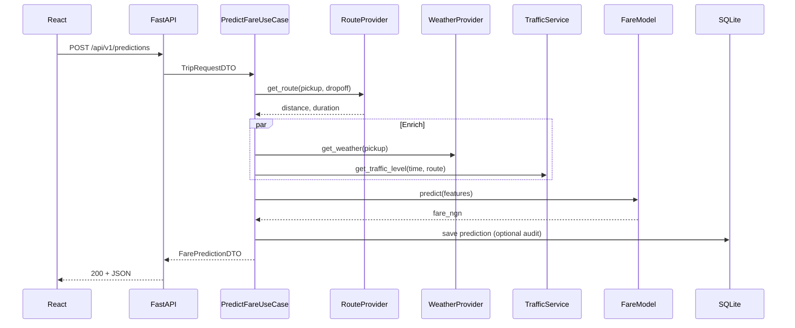

# Lagos Transport Fare Prediction — System Architecture

## 1. Vision

Predict **Lagos, Nigeria** ride fares from pickup/dropoff, derived distance, weather, traffic, and time-of-day. The system exposes a REST API (FastAPI) and a React UI for predictions and history.

## 2. Architectural Style: Clean Architecture

Dependencies point **inward**. Outer layers depend on inner abstractions, never the reverse.

```
┌─────────────────────────────────────────────────────────────┐
│  Presentation (FastAPI routes, React, OpenAPI)            │
├─────────────────────────────────────────────────────────────┤
│  Application (use cases, DTOs, orchestration)             │
├─────────────────────────────────────────────────────────────┤
│  Domain (entities, value objects, domain services, ports)   │
├─────────────────────────────────────────────────────────────┤
│  Infrastructure (SQLite, ORS, OWM, sklearn pipeline, HTTP) │
└─────────────────────────────────────────────────────────────┘
```

### Layer responsibilities

| Layer | Responsibility | Depends on |
|-------|----------------|------------|
| **Domain** | Fare rules, `TripRequest`, `FarePrediction`, repository & external service **interfaces** | Nothing external |
| **Application** | Use cases: predict fare, save trip, list history, train/reload model | Domain ports |
| **Infrastructure** | SQLite repos, ORS routing, OWM weather, traffic heuristic, sklearn `FareModel` | Domain + Application contracts |
| **Presentation** | HTTP controllers, validation schemas, error mapping, CORS | Application |

### SOLID mapping

| Principle | How we apply it |
|-----------|-----------------|
| **S** — Single responsibility | One use case per class; one adapter per external system |
| **O** — Open/closed | New traffic source = new `TrafficProvider` impl, no use-case change |
| **L** — Liskov substitution | All repo/provider implementations honor port contracts |
| **I** — Interface segregation | Small ports: `RouteProvider`, `WeatherProvider`, `FareRepository` |
| **D** — Dependency inversion | Use cases depend on `Protocol`/ABC ports, wired in `dependencies.py` |

## 3. Core domain model

```
TripRequest
  ├── pickup: GeoLocation (lat, lng, optional label)
  ├── dropoff: GeoLocation
  ├── requested_at: datetime (UTC)
  └── metadata: optional vehicle type

FarePrediction
  ├── predicted_fare_ngn: Decimal
  ├── distance_km: float
  ├── duration_min: float
  ├── features: FeatureVector (weather, traffic, hour, dow, ...)
  ├── model_version: str
  └── confidence / breakdown: optional for UI
```

**Feature vector** (model inputs):

- `distance_km` — from OpenRouteService
- `duration_min` — from ORS
- `hour_of_day` — 0–23 Lagos local (Africa/Lagos)
- `day_of_week` — 0–6
- `weather_code` or encoded conditions — OpenWeatherMap
- `temperature_c`, `humidity`, `precipitation_mm` — OWM
- `traffic_level` — enum `low | medium | high` (v1: time-based heuristic; v2: optional Google/HERE)

**Target**: `fare_ngn` (Nigerian Naira), trained on historical/synthetic Lagos data until real labels exist.

## 4. External integrations

| Service | Purpose | Failure mode |
|---------|---------|--------------|
| **OpenRouteService** | Driving distance & duration | 503 + retry hint; cache last route 24h optional |
| **OpenWeatherMap** | Current weather at pickup | Degrade to neutral weather features + log |
| **Traffic (v1)** | Peak-hour multiplier by Lagos zones | Pure domain service, no API key |

All HTTP clients: timeouts (5s connect, 15s read), structured errors, no secrets in logs.

## 5. Data flow: Predict Fare



## 6. API surface (versioned)

Base: `/api/v1`

| Method | Path | Description |
|--------|------|-------------|
| `POST` | `/predictions` | Predict fare from locations + time |
| `GET` | `/predictions` | Paginated history |
| `GET` | `/predictions/{id}` | Single record |
| `GET` | `/health` | Liveness |
| `GET` | `/health/ready` | DB + model loaded |
| `POST` | `/admin/model/reload` | Reload pickle (auth in prod) |

OpenAPI: auto-generated at `/docs` and `/redoc`.

## 7. Persistence (SQLite)

Tables (v1):

- `predictions` — id, pickup/dropoff JSON, features JSON, fare, model_version, created_at
- `model_metadata` — version, trained_at, metrics JSON

Migrations: Alembic (optional week 2) or SQL scripts in `infrastructure/db/migrations/`.

## 8. ML pipeline

1. **Training** (`scripts/train_model.py`): load CSV → feature engineering → `Pipeline(StandardScaler + RandomForestRegressor)` → `joblib` dump + metrics JSON.
2. **Inference** (`FareModel` adapter): load artifact at startup; thread-safe predict; version in response header.
3. **Fallback**: if model missing, rule-based baseline (distance × rate × traffic multiplier) so API never hard-crashes.

## 9. Error handling strategy

- **Domain**: `DomainError` hierarchy (invalid coordinates, same pickup/dropoff).
- **Application**: map to `ApplicationError` with codes.
- **Presentation**: global exception handlers → RFC 7807-style JSON:

```json
{
  "type": "validation_error",
  "title": "Invalid request",
  "status": 422,
  "detail": "...",
  "errors": []
}
```

- Never expose stack traces in production (`DEBUG=false`).
- Log correlation id per request (`X-Request-ID`).

## 10. Security & config (production checklist)

- Secrets via `.env` (never committed): `ORS_API_KEY`, `OWM_API_KEY`, `DATABASE_URL`
- CORS allowlist for React origin
- Rate limiting (slowapi) — week 2
- Input validation: Lagos bounding box approx. lat 6.4–6.6, lng 3.0–3.6 (configurable)

## 11. Two-week solo timeline

### Week 1 — Foundation & vertical slice

| Day | Focus |
|-----|--------|
| 1 | Repo scaffold, domain entities, ports, env template |
| 2 | ORS + OWM adapters, traffic heuristic, feature builder |
| 3 | Synthetic training data + train script + baseline model |
| 4 | `PredictFareUseCase` + SQLite repo + FastAPI routes |
| 5 | OpenAPI polish, error handlers, health checks |
| 6–7 | React: map picker (or lat/lng inputs), predict form, result card |

### Week 2 — Production hardening

| Day | Focus |
|-----|--------|
| 8 | History API + UI table |
| 9 | Model metrics display, reload endpoint |
| 10 | Integration tests (pytest + httpx) |
| 11 | Docker Compose (api + frontend), README deploy |
| 12 | Caching, logging, Lagos bbox validation |
| 13 | Buffer: real data ingest OR UI polish |
| 14 | Demo script, architecture doc review, git tag v0.1 |

## 12. Technology choices (rationale)

| Choice | Why |
|--------|-----|
| FastAPI | Async-ready, native OpenAPI, fast to ship |
| Scikit-learn | Solo-friendly, interpretable, no GPU needed |
| SQLite | Zero ops for MVP; swap DSN for Postgres later |
| React + Vite | Fast HMR, simple static deploy |
| Clean Architecture | Testable use cases; clear boundaries for 2-week scope |

## 13. Future extensions (out of scope v0.1)

- Postgres + Redis cache
- Real traffic API
- User accounts & saved places
- A/B model versions
- Batch retraining cron
