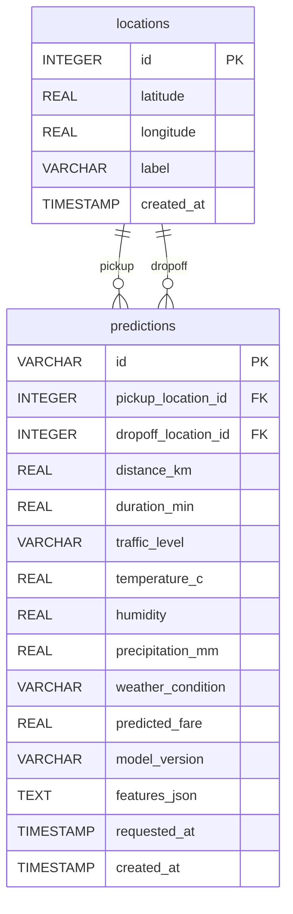

# Transport Fare Prediction — Database Design

## ER Diagram

## SQL Schema

See `backend/src/lagos_fare/infrastructure/db/migrations/001_initial.sql`

## SQLAlchemy Models

See `backend/src/lagos_fare/infrastructure/db/models.py`
