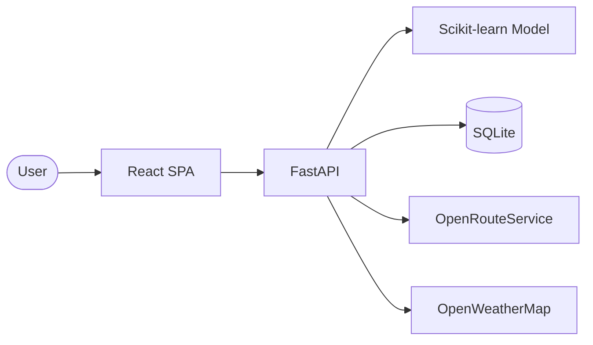
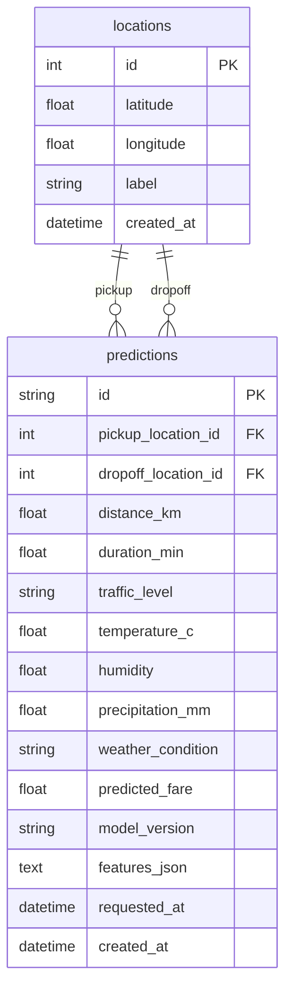

# Transportation Fare Prediction System

**Complete Project Documentation**

| Field | Value |
|-------|-------|
| Project Name | Transportation Fare Prediction System |
| Version | 1.0.0 |
| Tech Stack | React, FastAPI, Python, SQLite, Scikit-learn |
| Dataset | NYC TLC Yellow Taxi Trip Records |
| Date | June 2026 |

---

## Abstract

The Transportation Fare Prediction System estimates taxi/ride fares in real time by combining machine learning with live contextual data: route distance, trip duration, weather conditions, traffic patterns, and time of day. The system is built on a clean architecture backend (FastAPI + SQLite + Scikit-learn) and a React single-page application. It is trained on NYC TLC Yellow Taxi data and exposes a versioned REST API for fare predictions, weather lookups, and health monitoring. The design prioritizes modularity, testability, and production readiness with comprehensive error handling, environment-based configuration, and automated test coverage across ML, API, and UI layers.

---

## 1. Introduction

### 1.1 Problem statement

Transportation fares vary with distance, duration, demand (traffic), weather, and time of day. Riders and operators benefit from transparent fare estimates before a trip begins. This system addresses that need by:

1. Training a supervised regression model on historical NYC taxi trips
2. Enriching live requests with routing (OpenRouteService) and weather (OpenWeatherMap)
3. Serving predictions through a documented REST API and React UI

### 1.2 Goals

- Predict `fare_amount` (USD) from trip and contextual features
- Persist predictions for audit and analytics
- Degrade gracefully when external APIs or ML artifacts are unavailable
- Ship within a solo-developer timeline using proven, lightweight technologies

### 1.3 Scope (v1.0)

**In scope:** Yellow taxi fare prediction for NYC service area, REST API, React UI, SQLite persistence, model training pipeline, EDA and data prep scripts.

**Out of scope:** User authentication, payment processing, real-time traffic APIs, mobile native apps, multi-city deployment (architecture supports extension).

---

## 2. Architecture

### 2.1 Architectural style

The backend follows **Clean Architecture** with dependencies pointing inward:

```
Presentation (FastAPI, Pydantic)
    ↓
Application (Use Cases, DTOs, Services)
    ↓
Domain (Entities, Value Objects, Port Interfaces)
    ↑
Infrastructure (SQLite, ORS, OWM, sklearn)
```

### 2.2 SOLID principles

| Principle | Implementation |
|-----------|----------------|
| **S** | `PredictFareUseCase` orchestrates; `FeatureBuilder` builds features; each adapter handles one external system |
| **O** | New weather provider = new `WeatherProvider` implementation |
| **L** | `MockRouteProvider` substitutes cleanly in tests |
| **I** | Separate ports: `RouteProvider`, `WeatherProvider`, `FareModel`, `PredictionRepository` |
| **D** | Use cases depend on abstractions; concrete classes wired in `dependencies.py` |

### 2.3 System context



### 2.4 Prediction flow

1. User submits pickup/dropoff coordinates via React
2. FastAPI validates request (Pydantic + domain rules)
3. `PredictFareUseCase` fetches route and weather in parallel
4. `FeatureBuilder` assembles 16 TLC-aligned features
5. `SklearnFareModel` predicts fare (rule-based fallback if model missing)
6. Result persisted to SQLite (`locations` + `predictions`)
7. JSON response returned to UI

### 2.5 Folder structure

```
Transport/
├── backend/
│   ├── src/lagos_fare/          # Application source
│   ├── scripts/                 # train_model, nyc_tlc data prep
│   ├── tests/                   # unit, api, integration
│   └── artifacts/model.pkl      # Trained model (joblib)
├── frontend/src/                # React components, hooks, API client
├── data/                        # Raw, processed, reports
└── docs/                        # Architecture, API, testing, deployment
```

---

## 3. Dataset

### 3.1 Source

**NYC TLC Yellow Taxi Trip Records** — published monthly as Parquet files.

Download: [NYC TLC Trip Record Data](https://www.nyc.gov/site/tlc/about/tlc-trip-record-data.page)

### 3.2 Schema (key columns)

| Column | Description |
|--------|-------------|
| `tpep_pickup_datetime` | Trip start |
| `tpep_dropoff_datetime` | Trip end |
| `trip_distance` | Miles |
| `fare_amount` | Target variable (USD) |
| `PULocationID` / `DOLocationID` | TLC zone IDs |
| `passenger_count` | Passengers |
| `payment_type`, `RatecodeID` | Categorical features |

### 3.3 Data preparation pipeline

Script: `backend/scripts/nyc_tlc/prepare_data.py`

| Step | Action |
|------|--------|
| Load | Parquet or CSV |
| Invalid rows | Remove bad datetimes, negative distance, fare < $2.50 |
| Missing values | Drop core nulls; impute passengers/fees |
| Outliers | IQR on fare, distance, duration; speed sanity check |
| Features | Duration, speed, hour, DOW, rush hour, zones |
| Split | Time-based 80/20 train/test |

Outputs: `data/processed/nyc_tlc/X_train.parquet`, `y_train.parquet`, etc.

### 3.4 EDA

Script: `backend/scripts/nyc_tlc/eda.py`

Produces fare distributions, correlation heatmaps, outlier boxplots, temporal patterns, and location effects in `data/reports/nyc_tlc/eda/`.

---

## 4. Machine Learning Approach

### 4.1 Problem formulation

**Type:** Supervised regression  
**Target:** `fare_amount` (USD)  
**Features:** 16 engineered columns (distance, duration, speed, time, location, traffic proxy)

### 4.2 Models evaluated

| Model | Pipeline | Notes |
|-------|----------|-------|
| Linear Regression | `StandardScaler` → `LinearRegression` | Interpretable baseline |
| Random Forest | `RandomForestRegressor(n=100, max_depth=16)` | Non-linear interactions |

### 4.3 Selection criteria

Best model selected by **lowest RMSE** on time-based hold-out test set.

**Sample results:**

| Model | MAE | RMSE | R² |
|-------|-----|------|-----|
| Linear Regression ✓ | 0.79 | 0.99 | 0.967 |
| Random Forest | 0.83 | 1.02 | 0.965 |

### 4.4 Training

```powershell
cd backend
python scripts\train_model.py
```

Artifact saved to `backend/artifacts/model.pkl` (joblib dict with pipeline, feature names, version, metrics).

### 4.5 Inference

`SklearnFareModel` loads artifact at startup. Feature column order must match training. Minimum fare floor: $2.50. If artifact missing, `RuleBasedFallback` computes distance × rate estimate.

### 4.6 Live feature mapping

Training uses historical TLC zones; live API maps lat/lng to pseudo-zones and converts ORS km → miles to align with training data.

---

## 5. API Documentation

**Base URL:** `/api/v1`  
**OpenAPI:** `/docs` (Swagger), `/redoc`

### 5.1 Endpoints

| Method | Path | Description |
|--------|------|-------------|
| `GET` | `/health` | Liveness probe |
| `GET` | `/health/ready` | DB + model readiness |
| `POST` | `/predictions` | Predict fare |
| `POST` | `/weather` | Weather at coordinates |

### 5.2 POST /predictions

**Request:**
```json
{
  "pickup": { "latitude": 40.6413, "longitude": -73.7781, "label": "JFK" },
  "dropoff": { "latitude": 40.758, "longitude": -73.9855, "label": "Times Square" },
  "passenger_count": 2
}
```

**Response (200):**
```json
{
  "id": "uuid",
  "predicted_fare_ngn": 46.39,
  "distance_km": 28.3,
  "duration_min": 56.6,
  "traffic_level": "high",
  "weather_summary": "clear sky",
  "model_version": "linear_regression-v1",
  "temperature_c": 22.0,
  "humidity": 60.0,
  "precipitation_mm": 0.0,
  "weather_condition": "clear sky"
}
```

### 5.3 POST /weather

**Request:** `{ "latitude": 40.758, "longitude": -73.9855 }`

**Response:** `{ "temperature", "rainfall", "humidity", "weather_condition" }`

### 5.4 Error format

RFC 7807-inspired JSON:

```json
{
  "type": "validation_error",
  "title": "Invalid request",
  "status": 422,
  "detail": "...",
  "errors": []
}
```

| Status | Type | Cause |
|--------|------|-------|
| 400 | `invalid_coordinates` | Outside NYC bbox |
| 400 | `same_location` | Identical pickup/dropoff |
| 422 | `validation_error` | Pydantic validation |
| 502 | `external_service_error` | ORS/OWM hard failure |
| 500 | `internal_error` | Unhandled (detail hidden in production) |

---

## 6. Database

### 6.1 ER diagram



### 6.2 SQLAlchemy models

`backend/src/lagos_fare/infrastructure/db/models.py` — `LocationORM`, `PredictionORM`

---

## 7. Testing

See [TESTING.md](TESTING.md) for full test case matrix.

### 7.1 Summary

| Suite | Count | Command |
|-------|-------|---------|
| Backend unit | 20+ | `pytest backend/tests/unit/` |
| Backend API | 10+ | `pytest backend/tests/api/` |
| Backend integration | 4 | `pytest backend/tests/integration/` |
| Frontend | 11+ | `npm test` (in `frontend/`) |

### 7.2 Strategy

- **Unit:** Pure logic (ML, features, validation) — no I/O
- **API:** httpx `AsyncClient` with mocked ORS/OWM and in-memory SQLite
- **Integration:** Full request → DB row verification
- **Frontend:** Vitest + Testing Library + axios-mock-adapter

---

## 8. Deployment

### 8.1 Frontend — Vercel

1. Connect GitHub repo to Vercel
2. Set root directory: `frontend`
3. Build command: `npm run build`
4. Output directory: `dist`

**Environment variables:**

| Variable | Value |
|----------|-------|
| `VITE_API_BASE_URL` | `https://your-api.onrender.com` |

### 8.2 Backend — Render

1. Create **Web Service** on Render
2. Root directory: `backend`
3. Build command: `pip install -r requirements.txt`
4. Start command: `uvicorn lagos_fare.main:app --host 0.0.0.0 --port $PORT --app-dir src`

**Environment variables:**

| Variable | Required | Description |
|----------|----------|-------------|
| `DATABASE_URL` | Yes | `sqlite+aiosqlite:///./data/transport_fare.db` or Postgres URL |
| `MODEL_PATH` | Yes | `artifacts/model.pkl` |
| `ORS_API_KEY` | No | OpenRouteService key |
| `OWM_API_KEY` | No | OpenWeatherMap key |
| `CORS_ORIGINS` | Yes | `https://your-app.vercel.app` |
| `DEBUG` | No | `false` in production |
| `SERVICE_TIMEZONE` | No | `America/New_York` |

**Production settings:**

- Use Render persistent disk for SQLite and model artifact
- Set `DEBUG=false`
- Restrict `CORS_ORIGINS` to Vercel domain only
- Add health check path: `/api/v1/health/ready`

### 8.3 Local development

```powershell
# Backend
cd backend
pip install -r requirements.txt
python -m uvicorn lagos_fare.main:app --reload --app-dir src

# Frontend
cd frontend
npm install
npm run dev
```

---

## 9. Future Improvements

| Priority | Enhancement |
|----------|-------------|
| High | Train on full NYC TLC months (not sample data) |
| High | TLC zone lookup table instead of pseudo-zones |
| High | JWT authentication for API |
| Medium | Postgres + connection pooling for production |
| Medium | Redis cache for ORS route responses |
| Medium | Real traffic API (Google/HERE) |
| Medium | Prediction history UI |
| Medium | CI/CD pipeline (GitHub Actions) |
| Low | SHAP explainability for fare breakdown |
| Low | A/B model versioning |
| Low | Batch retraining cron job |
| Low | Multi-city configuration profiles |

---

## 10. References

- [NYC TLC Trip Record Data](https://www.nyc.gov/site/tlc/about/tlc-trip-record-data.page)
- [OpenRouteService API](https://openrouteservice.org/)
- [OpenWeatherMap API](https://openweathermap.org/api)
- [FastAPI Documentation](https://fastapi.tiangolo.com/)
- [Scikit-learn User Guide](https://scikit-learn.org/stable/user_guide.html)

---

*Documentation maintained in `docs/PROJECT_DOCUMENTATION.md`.*
