# Systems Analysis and Design Documentation Package

## Lagos Transport Fare Prediction System Using Machine Learning

**Author:** Systems Analysis Team  
**Version:** 2.0 (Lagos Edition)  
**Date:** June 2026

---

# SECTION 1: USE CASE DIAGRAM

## 1.1 Diagram Explanation

The Use Case Diagram models functional requirements from the perspective of external actors interacting with the Lagos Transport Fare Prediction System. It defines system boundaries and enumerates services the system provides.

## 1.2 Diagram Components

| Actor | Role |
|-------|------|
| **User** | Commuter requesting fare estimates |
| **Administrator** | Generates reports and analytics |
| **OpenRouteService API** | External routing provider |
| **OpenWeatherMap API** | External weather provider |

**Use Cases:** Select Pickup/Destination, Select Transport Type, Request Fare Prediction, View Route/Weather/Fare, Store Prediction, Generate Reports, View Analytics.

## 1.3 Mermaid Code

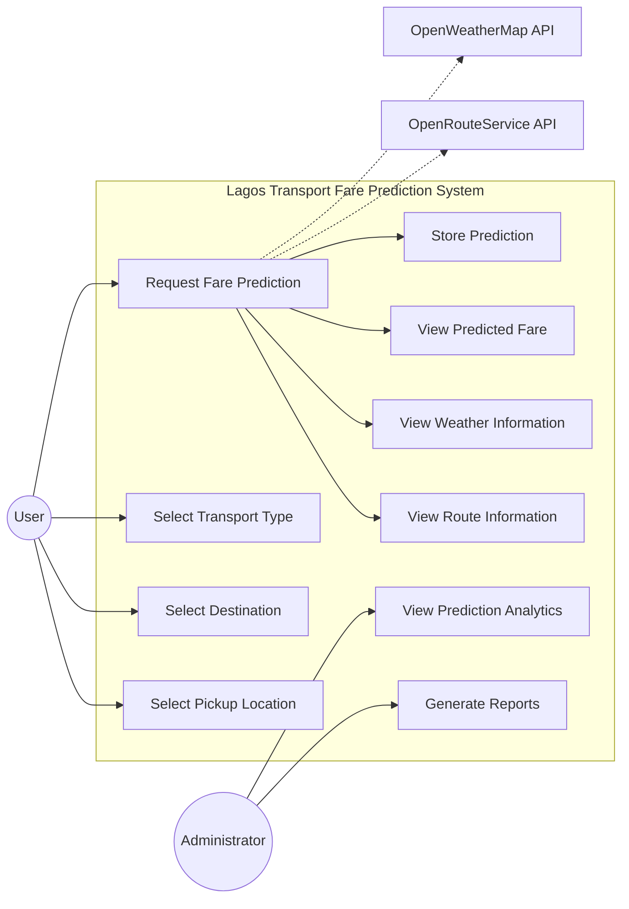

## 1.4 PlantUML Code

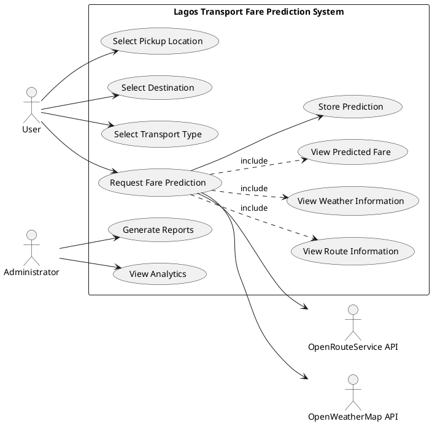

## 1.5 Academic Description

The use case model captures the functional scope of the proposed system within the context of Lagos urban mobility. The primary actor (User) initiates fare prediction by specifying origin, destination, and transport mode among Taxi, Bolt, Uber, Keke, BRT, and Danfo. The system orchestrates external API calls as secondary actors, persisting results for subsequent analytical review by the Administrator.

---

# SECTION 2: CONTEXT DIAGRAM

## 2.1 Diagram Explanation

The Context Diagram (Level 0) depicts the system as a single process bounded from its environment, showing data flows between external entities and the central system.

## 2.2 Components

- **User** → trip request → **System** → fare estimate (₦) → **User**
- **Administrator** → report request → **System** → CSV/Excel/charts → **Admin**
- **System** ↔ coordinates → **Route API**
- **System** ↔ coordinates → **Weather API**

## 2.3 Mermaid

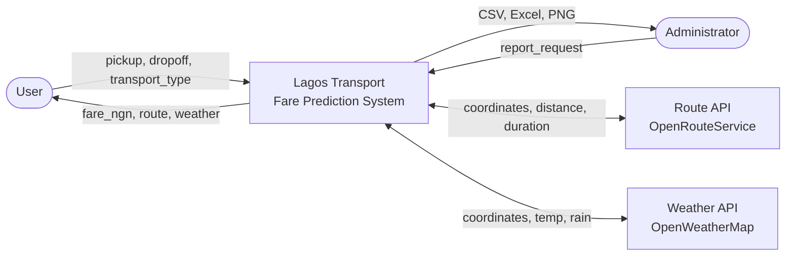

## 2.4 PlantUML

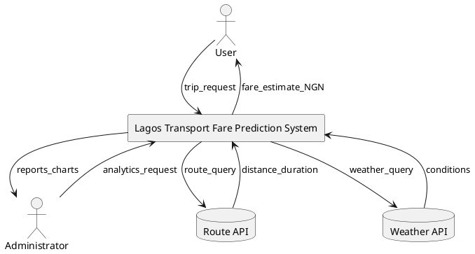

## 2.5 Academic Description

At the highest abstraction level, the system functions as an intermediary between commuters and external geospatial/meteorological data providers, transforming heterogeneous inputs into unified fare estimates denominated in Nigerian Naira.

---

# SECTION 3: DATA FLOW DIAGRAMS

## 3A. DFD Level 0

### Mermaid

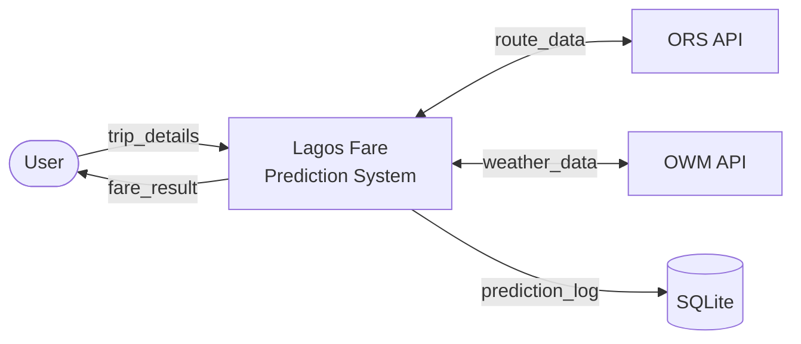

### Academic Description

DFD Level 0 consolidates all internal processing into a single bubble, emphasising external data sources and persistent storage.

## 3B. DFD Level 1

### Mermaid

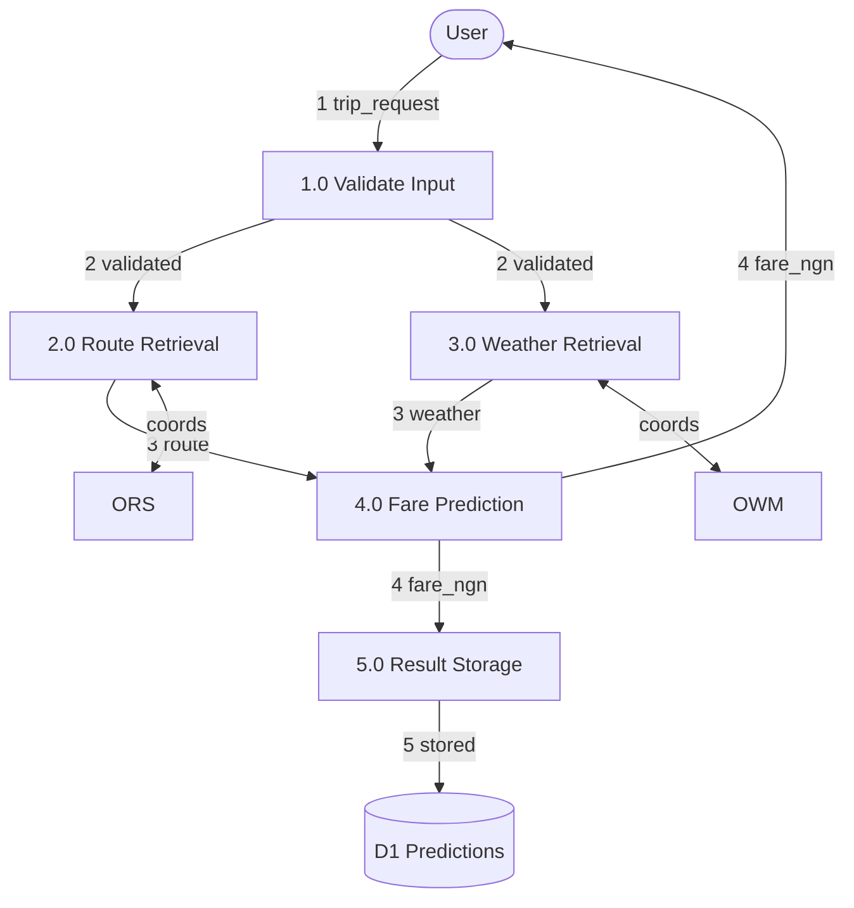

### Processes

| ID | Process | Input | Output |
|----|---------|-------|--------|
| 1.0 | Validate Input | trip_request | validated_trip |
| 2.0 | Route Retrieval | coordinates | distance_km, duration_min |
| 3.0 | Weather Retrieval | coordinates | temperature, rainfall, condition |
| 4.0 | Fare Prediction | features | fare_ngn |
| 5.0 | Result Storage | prediction | DB record |

## 3C. DFD Level 2 — Fare Prediction (4.0)

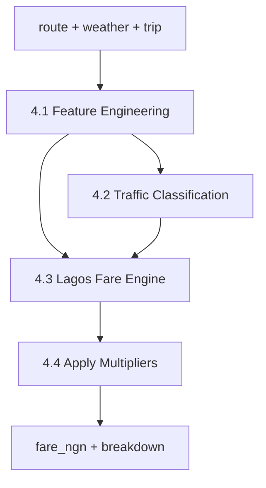

---

# SECTION 4: ENTITY RELATIONSHIP DIAGRAM

## 4.1 ERD (3NF)

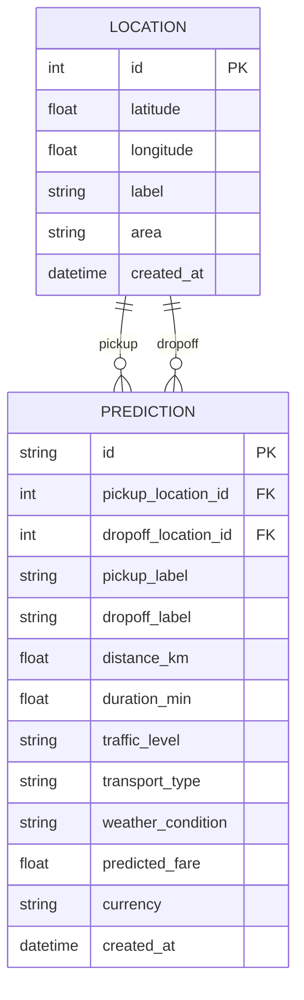

## 4.2 SQL Schema

```sql
CREATE TABLE locations (
    id INTEGER PRIMARY KEY AUTOINCREMENT,
    latitude REAL NOT NULL,
    longitude REAL NOT NULL,
    label VARCHAR(120),
    area VARCHAR(80),
    created_at TIMESTAMP DEFAULT CURRENT_TIMESTAMP
);

CREATE TABLE predictions (
    id VARCHAR(36) PRIMARY KEY,
    pickup_location_id INTEGER NOT NULL REFERENCES locations(id),
    dropoff_location_id INTEGER NOT NULL REFERENCES locations(id),
    pickup_label VARCHAR(120),
    dropoff_label VARCHAR(120),
    distance_km REAL NOT NULL,
    duration_min REAL NOT NULL,
    traffic_level VARCHAR(20) NOT NULL,
    transport_type VARCHAR(20) NOT NULL,
    weather_condition VARCHAR(40) NOT NULL,
    predicted_fare REAL NOT NULL,
    currency VARCHAR(3) DEFAULT 'NGN',
    model_version VARCHAR(64) NOT NULL,
    features_json TEXT NOT NULL,
    requested_at TIMESTAMP NOT NULL,
    created_at TIMESTAMP DEFAULT CURRENT_TIMESTAMP
);
```

## 4.3 Academic Description

The schema normalises location data to eliminate redundancy while denormalising weather and route attributes within predictions for analytical query performance.

---

# SECTION 5: CLASS DIAGRAM

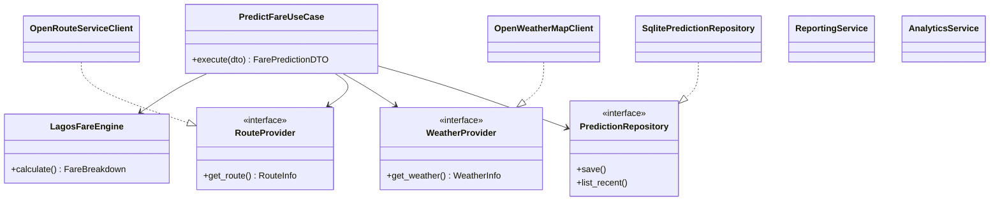

---

# SECTION 6: SEQUENCE DIAGRAM

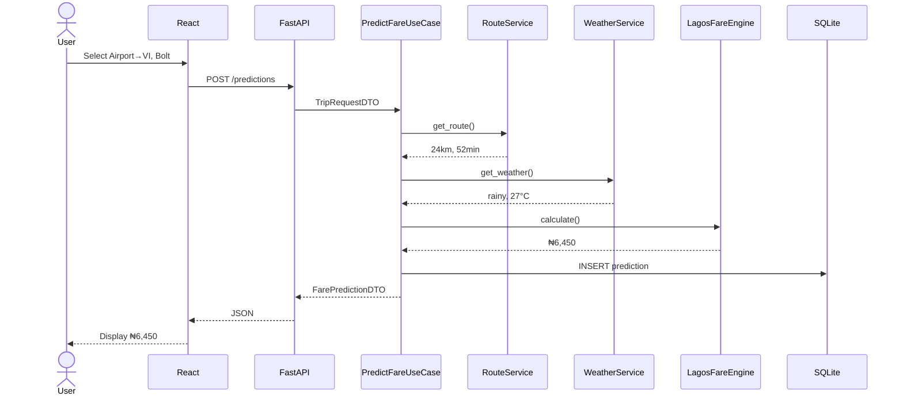

---

# SECTION 7: ACTIVITY DIAGRAM

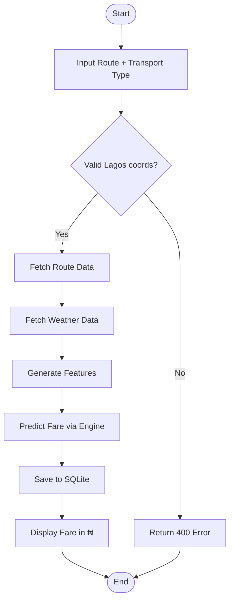

---

# SECTION 8: COMPONENT DIAGRAM

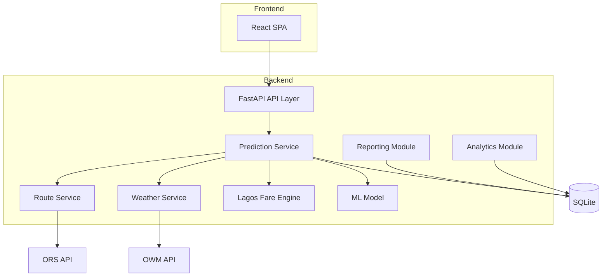

---

# SECTION 9: DEPLOYMENT DIAGRAM

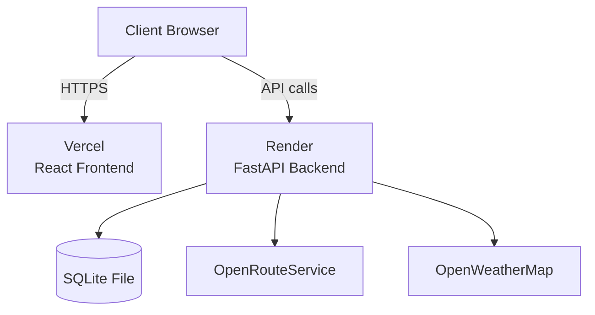

---

# SECTION 10: SYSTEM ARCHITECTURE

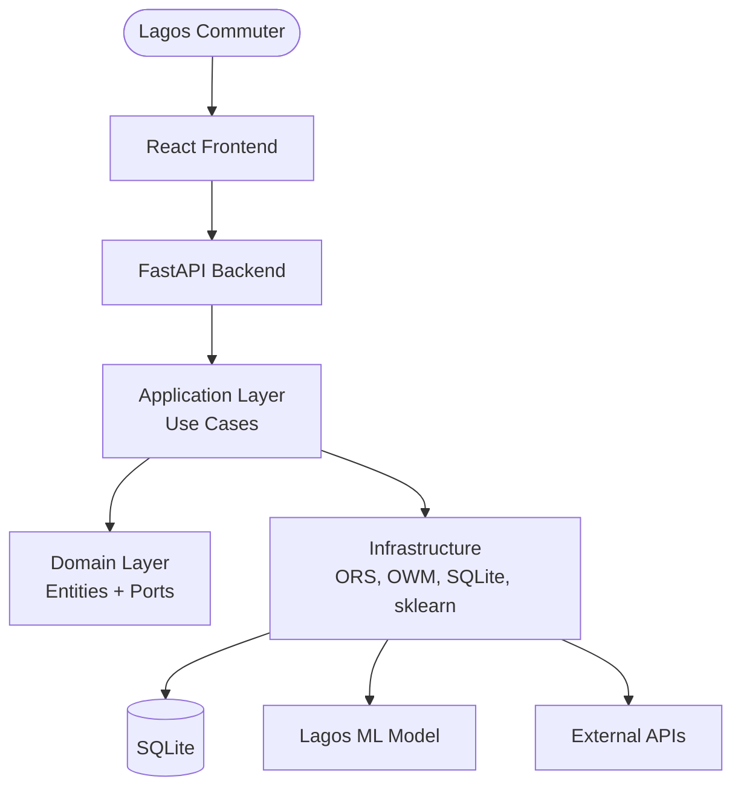

---

# SECTION 11: MACHINE LEARNING WORKFLOW

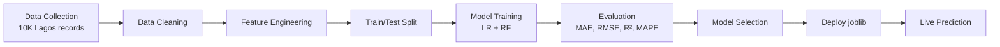

---

# SECTION 12: RESEARCH METHODOLOGY

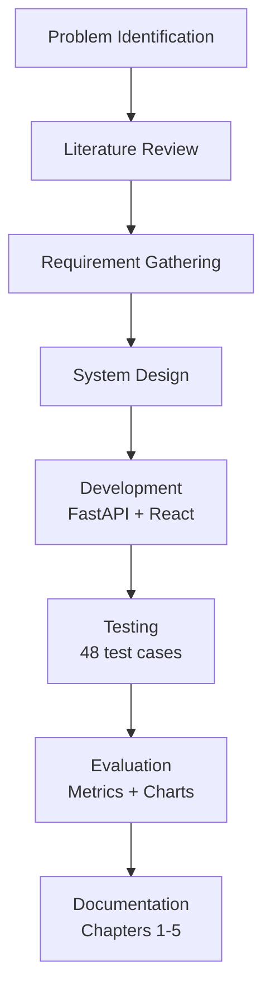

---

*End of Systems Analysis and Design Package*
