# Transportation Fare Prediction System — Complete Software Architecture

**Project:** Lagos, Nigeria fare prediction  
**Stack:** React · FastAPI · Scikit-learn · SQLite · OpenRouteService · OpenWeatherMap  
**Version:** 0.1.0  
**Style:** Clean Architecture + SOLID

---

## Table of contents

1. [Architecture diagram](#1-architecture-diagram)
2. [Folder structure](#2-folder-structure)
3. [Database schema](#3-database-schema)
4. [API endpoints](#4-api-endpoints)
5. [Data flow](#5-data-flow)
6. [Deployment architecture](#6-deployment-architecture)

---

## 1. Architecture diagram

### 1.1 System context (C4 Level 1)

Shows the system boundary and external actors/services.

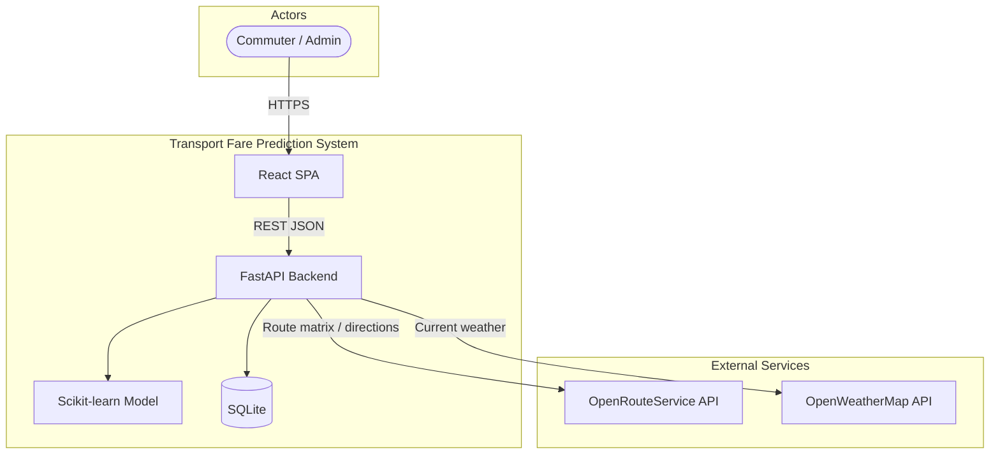

### 1.2 Clean architecture layers (C4 Level 2)

Dependencies point **inward**. Outer layers implement interfaces defined by inner layers.

```mermaid
flowchart TB
    subgraph presentation [Presentation Layer]
        ReactUI[React Frontend]
        FastAPIRoutes[FastAPI Routers]
        PydanticSchemas[Pydantic Schemas]
        ErrorHandlers[Exception Handlers]
    end

    subgraph application [Application Layer]
        PredictUC[PredictFareUseCase]
        HistoryUC[GetPredictionHistoryUseCase]
        DetailUC[GetPredictionByIdUseCase]
        FeatureBuilder[FeatureBuilder]
        TrafficService[TrafficService]
        DTOs[DTOs]
    end

    subgraph domain [Domain Layer]
        Entities[TripRequest · FarePrediction · GeoLocation]
        ValueObjects[FeatureVector · TrafficLevel]
        Ports[RouteProvider · WeatherProvider · FareModel · PredictionRepository]
        DomainErrors[DomainError hierarchy]
    end

    subgraph infrastructure [Infrastructure Layer]
        ORSAdapter[OpenRouteServiceClient]
        OWMAdapter[OpenWeatherMapClient]
        SklearnModel[SklearnFareModel]
        RuleFallback[RuleBasedFallback]
        SQLiteRepo[SqlitePredictionRepository]
        SQLAlchemy[SQLAlchemy ORM]
    end

    ReactUI --> FastAPIRoutes
    FastAPIRoutes --> PredictUC
    FastAPIRoutes --> HistoryUC
    FastAPIRoutes --> DetailUC
    PredictUC --> FeatureBuilder
    PredictUC --> TrafficService
    PredictUC --> Ports
    HistoryUC --> Ports
    DetailUC --> Ports

    ORSAdapter -.->|implements| Ports
    OWMAdapter -.->|implements| Ports
    SklearnModel -.->|implements| Ports
    RuleFallback -.->|implements| Ports
    SQLiteRepo -.->|implements| Ports
    SQLiteRepo --> SQLAlchemy
```

### 1.3 Component diagram (backend)

```mermaid
flowchart LR
    subgraph client [Client]
        Browser[Browser]
    end

    subgraph api_server [FastAPI Server]
        direction TB
        MW[CORS · Request ID Middleware]
        V1[/api/v1 Router]
        Health[Health Controller]
        Pred[Predictions Controller]
        DI[dependencies.py]
        MW --> V1
        V1 --> Health
        V1 --> Pred
        Pred --> DI
    end

    subgraph use_cases [Use Cases]
        PF[PredictFare]
        GH[GetHistory]
        GD[GetById]
    end

    subgraph adapters [Adapters]
        ORS[ORS Client]
        OWM[OWM Client]
        ML[ML Pipeline]
        Repo[SQLite Repo]
    end

    subgraph storage [Storage]
        SQLite[(lagos_fare.db)]
        Artifact[fare_model.joblib]
    end

    Browser --> MW
    DI --> PF
    DI --> GH
    DI --> GD
    PF --> ORS
    PF --> OWM
    PF --> ML
    PF --> Repo
    GH --> Repo
    GD --> Repo
    ML --> Artifact
    Repo --> SQLite
```

### 1.4 Layer responsibilities

| Layer | Technology | Responsibility |
|-------|------------|----------------|
| **Presentation** | React, FastAPI, Pydantic | UI, HTTP, validation, OpenAPI, error mapping |
| **Application** | Pure Python | Use-case orchestration, DTO mapping, feature assembly |
| **Domain** | Pure Python | Business entities, rules, port interfaces |
| **Infrastructure** | SQLAlchemy, httpx, sklearn | External APIs, persistence, ML inference |

### 1.5 SOLID mapping

| Principle | Application |
|-----------|-------------|
| **S** — Single Responsibility | One use case per class; one adapter per external system |
| **O** — Open/Closed | Swap ORS for Google Maps by adding a new `RouteProvider` |
| **L** — Liskov Substitution | All adapters honor port contracts without surprising callers |
| **I** — Interface Segregation | Small ports: routing, weather, model, repository |
| **D** — Dependency Inversion | Use cases depend on abstractions; wired in `dependencies.py` |

---

## 2. Folder structure

```
Transport/
├── backend/
│   ├── pyproject.toml
│   ├── requirements.txt
│   ├── .env.example
│   ├── README.md
│   │
│   ├── src/lagos_fare/
│   │   ├── __init__.py
│   │   ├── main.py                         # FastAPI app factory + lifespan
│   │   ├── config.py                       # pydantic-settings (env validation)
│   │   ├── dependencies.py                 # Dependency injection container
│   │   │
│   │   ├── domain/                         # ★ Innermost — zero framework deps
│   │   │   ├── entities/
│   │   │   │   ├── geo_location.py         # lat, lng, label
│   │   │   │   ├── trip_request.py         # pickup, dropoff, requested_at
│   │   │   │   └── fare_prediction.py      # result entity
│   │   │   ├── value_objects/
│   │   │   │   ├── feature_vector.py       # ML input vector
│   │   │   │   └── traffic_level.py        # low | medium | high
│   │   │   ├── ports/
│   │   │   │   ├── route_provider.py       # ABC: get_route()
│   │   │   │   ├── weather_provider.py     # ABC: get_weather()
│   │   │   │   ├── fare_model.py           # ABC: predict()
│   │   │   │   └── prediction_repository.py
│   │   │   └── exceptions.py
│   │   │
│   │   ├── application/                    # Use cases + orchestration
│   │   │   ├── dto/
│   │   │   │   ├── trip_request_dto.py
│   │   │   │   └── prediction_dto.py
│   │   │   ├── services/
│   │   │   │   ├── feature_builder.py      # route + weather + time → features
│   │   │   │   └── traffic_service.py      # Lagos rush-hour heuristic
│   │   │   └── use_cases/
│   │   │       ├── predict_fare.py
│   │   │       ├── get_prediction_history.py
│   │   │       └── get_prediction_by_id.py
│   │   │
│   │   ├── infrastructure/                 # Adapters (implement ports)
│   │   │   ├── db/
│   │   │   │   ├── database.py             # async engine + session
│   │   │   │   ├── models.py               # SQLAlchemy ORM
│   │   │   │   ├── sqlite_prediction_repository.py
│   │   │   │   └── migrations/
│   │   │   │       └── 001_initial.sql
│   │   │   ├── external/
│   │   │   │   ├── http_client.py          # shared httpx + retries
│   │   │   │   ├── openroute_service.py
│   │   │   │   └── openweather_map.py
│   │   │   └── ml/
│   │   │       ├── sklearn_fare_model.py   # joblib pipeline loader
│   │   │       └── rule_based_fallback.py  # baseline when model missing
│   │   │
│   │   └── presentation/
│   │       ├── api/
│   │       │   ├── errors.py               # RFC 7807-style handlers
│   │       │   └── v1/
│   │       │       ├── router.py
│   │       │       ├── health.py
│   │       │       ├── predictions.py
│   │       │       └── admin.py            # model reload (protected)
│   │       └── schemas/
│   │           ├── prediction.py
│   │           └── common.py
│   │
│   ├── tests/
│   │   ├── conftest.py
│   │   ├── unit/
│   │   └── integration/
│   │       └── test_predictions_api.py
│   │
│   ├── scripts/
│   │   ├── generate_synthetic_data.py
│   │   └── train_model.py
│   │
│   └── artifacts/                          # gitignored model files
│       ├── fare_model.joblib
│       └── model_metrics.json
│
├── frontend/
│   ├── package.json
│   ├── vite.config.ts
│   ├── tsconfig.json
│   ├── .env.example
│   └── src/
│       ├── main.tsx
│       ├── App.tsx
│       ├── api/
│       │   └── client.ts                   # fetch wrapper + error handling
│       ├── components/
│       │   ├── FareForm.tsx                # pickup/dropoff inputs
│       │   ├── PredictionResult.tsx        # fare card + breakdown
│       │   ├── PredictionHistory.tsx       # paginated table
│       │   └── MapPicker.tsx               # optional Leaflet map
│       ├── hooks/
│       │   └── usePrediction.ts
│       └── types/
│           └── prediction.ts
│
├── data/
│   ├── raw/
│   └── processed/
│       └── lagos_fares_synthetic.csv
│
├── docs/
│   ├── SYSTEM_ARCHITECTURE.md              # ← this document
│   ├── ARCHITECTURE.md
│   ├── FOLDER_STRUCTURE.md
│   └── API.md
│
├── docker/
│   ├── Dockerfile.api
│   ├── Dockerfile.web
│   └── docker-compose.yml
│
├── .gitignore
├── .env.example
└── README.md
```

### Import rules

| From | May import |
|------|------------|
| `domain` | Standard library only |
| `application` | `domain` |
| `infrastructure` | `domain`, third-party libs |
| `presentation` | `application`, `domain` (errors only) |
| `main.py` / `dependencies.py` | All layers (composition root) |

---

## 3. Database schema

SQLite database file: `lagos_fare.db` (path configurable via `DATABASE_URL`).

### 3.1 Entity-relationship diagram

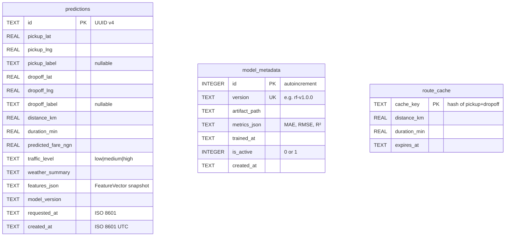

### 3.2 DDL — `predictions`

Stores every fare prediction for audit, analytics, and history UI.

```sql
CREATE TABLE IF NOT EXISTS predictions (
    id                  TEXT PRIMARY KEY,           -- UUID
    pickup_lat          REAL NOT NULL,
    pickup_lng          REAL NOT NULL,
    pickup_label        TEXT,
    dropoff_lat         REAL NOT NULL,
    dropoff_lng         REAL NOT NULL,
    dropoff_label       TEXT,
    distance_km         REAL NOT NULL,
    duration_min        REAL NOT NULL,
    predicted_fare_ngn  REAL NOT NULL,
    traffic_level       TEXT NOT NULL CHECK (traffic_level IN ('low', 'medium', 'high')),
    weather_summary     TEXT NOT NULL DEFAULT 'unknown',
    features_json       TEXT NOT NULL,              -- JSON blob of FeatureVector
    model_version       TEXT NOT NULL,
    requested_at        TEXT NOT NULL,              -- trip time (ISO 8601)
    created_at          TEXT NOT NULL DEFAULT (datetime('now'))
);

CREATE INDEX idx_predictions_created_at ON predictions (created_at DESC);
CREATE INDEX idx_predictions_model_version ON predictions (model_version);
```

**`features_json` example:**

```json
{
  "distance_km": 12.4,
  "duration_min": 38.2,
  "hour_of_day": 8,
  "day_of_week": 2,
  "temperature_c": 28.5,
  "humidity": 82.0,
  "precipitation_mm": 1.2,
  "traffic_level": "high"
}
```

### 3.3 DDL — `model_metadata`

Tracks trained model versions and evaluation metrics.

```sql
CREATE TABLE IF NOT EXISTS model_metadata (
    id              INTEGER PRIMARY KEY AUTOINCREMENT,
    version         TEXT NOT NULL UNIQUE,
    artifact_path   TEXT NOT NULL,
    metrics_json    TEXT NOT NULL,                  -- {"mae": 120.5, "rmse": 180.2, "r2": 0.87}
    trained_at      TEXT NOT NULL,
    is_active       INTEGER NOT NULL DEFAULT 0 CHECK (is_active IN (0, 1)),
    created_at      TEXT NOT NULL DEFAULT (datetime('now'))
);

CREATE UNIQUE INDEX idx_model_active ON model_metadata (is_active) WHERE is_active = 1;
```

### 3.4 DDL — `route_cache` (optional, Week 2)

Reduces OpenRouteService calls for repeated origin–destination pairs.

```sql
CREATE TABLE IF NOT EXISTS route_cache (
    cache_key       TEXT PRIMARY KEY,               -- SHA256(pickup|dropoff rounded to 4dp)
    distance_km     REAL NOT NULL,
    duration_min    REAL NOT NULL,
    expires_at      TEXT NOT NULL,
    created_at      TEXT NOT NULL DEFAULT (datetime('now'))
);

CREATE INDEX idx_route_cache_expires ON route_cache (expires_at);
```

### 3.5 Column summary

| Table | Rows (est. MVP) | Purpose |
|-------|-----------------|---------|
| `predictions` | 1k–100k | User-facing history, retraining labels |
| `model_metadata` | 1–10 | Active model pointer + metrics |
| `route_cache` | 100–5k | ORS cost/latency optimization |

### 3.6 Migration strategy

- **v0.1:** SQL scripts in `infrastructure/db/migrations/`
- **v0.2+:** Alembic for versioned migrations
- **Postgres path:** Same schema; swap `DATABASE_URL` DSN only

---

## 4. API endpoints

**Base URL:** `/api/v1`  
**OpenAPI:** `/docs` (Swagger UI) · `/redoc` (ReDoc)  
**Content-Type:** `application/json`

### 4.1 Endpoint overview

| Method | Path | Auth | Description |
|--------|------|------|-------------|
| `GET` | `/health` | None | Liveness probe |
| `GET` | `/health/ready` | None | Readiness (DB + model) |
| `POST` | `/predictions` | None* | Predict fare |
| `GET` | `/predictions` | None* | List prediction history |
| `GET` | `/predictions/{id}` | None* | Get single prediction |
| `POST` | `/admin/model/reload` | API key | Hot-reload ML artifact |
| `GET` | `/admin/model/info` | API key | Active model + metrics |

\* Add JWT/API key in production if needed.

---

### 4.2 `GET /health`

**Purpose:** Kubernetes/Docker liveness — process is running.

**Response `200`:**

```json
{ "status": "ok" }
```

---

### 4.3 `GET /health/ready`

**Purpose:** Readiness — DB reachable and model loaded (or fallback active).

**Response `200`:**

```json
{
  "status": "ready",
  "database": "ok",
  "model": "ok",
  "model_version": "rf-v1.0.0",
  "fallback_active": false
}
```

**Response `503`:** DB down or critical startup failure.

---

### 4.4 `POST /predictions`

**Purpose:** Core endpoint — predict fare from trip details.

**Request body:**

```json
{
  "pickup": {
    "latitude": 6.5244,
    "longitude": 3.3792,
    "label": "Victoria Island"
  },
  "dropoff": {
    "latitude": 6.4654,
    "longitude": 3.4064,
    "label": "Lekki Phase 1"
  },
  "requested_at": "2026-06-03T08:30:00+01:00"
}
```

| Field | Type | Required | Constraints |
|-------|------|----------|-------------|
| `pickup.latitude` | float | yes | 6.35–6.65 (Lagos bbox, configurable) |
| `pickup.longitude` | float | yes | 2.95–3.65 |
| `pickup.label` | string | no | max 120 chars |
| `dropoff` | GeoPoint | yes | same rules as pickup |
| `requested_at` | datetime | no | ISO 8601; defaults to now (Africa/Lagos) |

**Response `200`:**

```json
{
  "id": "a1b2c3d4-e5f6-7890-abcd-ef1234567890",
  "predicted_fare_ngn": 2850.50,
  "distance_km": 12.4,
  "duration_min": 38.2,
  "traffic_level": "high",
  "weather_summary": "light rain",
  "model_version": "rf-v1.0.0",
  "breakdown": {
    "base_fare_ngn": 2000.00,
    "traffic_multiplier": 1.15,
    "weather_adjustment_ngn": 50.00
  }
}
```

**Response headers:**

| Header | Value |
|--------|-------|
| `X-Request-ID` | UUID correlation id |
| `X-Model-Version` | e.g. `rf-v1.0.0` |

**Error responses:**

| Status | `type` | Cause |
|--------|--------|-------|
| `422` | `validation_error` | Invalid coords, malformed JSON |
| `400` | `invalid_coordinates` | Outside Lagos service area |
| `400` | `same_location` | Pickup equals dropoff |
| `502` | `external_service_error` | ORS unreachable after retries |
| `503` | `service_unavailable` | Neither ML model nor fallback available |

**Error body (RFC 7807-inspired):**

```json
{
  "type": "validation_error",
  "title": "Invalid request",
  "status": 422,
  "detail": "pickup.latitude must be within Lagos bounds",
  "errors": [
    { "field": "pickup.latitude", "message": "Value 5.0 out of range" }
  ]
}
```

---

### 4.5 `GET /predictions`

**Purpose:** Paginated prediction history for the React history table.

**Query parameters:**

| Param | Type | Default | Max | Description |
|-------|------|---------|-----|-------------|
| `page` | int | 1 | — | 1-based page |
| `page_size` | int | 20 | 100 | Items per page |
| `from_date` | date | — | — | Filter `created_at >= from_date` |
| `to_date` | date | — | — | Filter `created_at <= to_date` |

**Response `200`:**

```json
{
  "items": [
    {
      "id": "a1b2c3d4-e5f6-7890-abcd-ef1234567890",
      "predicted_fare_ngn": 2850.50,
      "distance_km": 12.4,
      "duration_min": 38.2,
      "traffic_level": "high",
      "weather_summary": "light rain",
      "model_version": "rf-v1.0.0",
      "pickup_label": "Victoria Island",
      "dropoff_label": "Lekki Phase 1",
      "created_at": "2026-06-03T07:35:12Z"
    }
  ],
  "total": 142,
  "page": 1,
  "page_size": 20
}
```

---

### 4.6 `GET /predictions/{id}`

**Purpose:** Fetch one prediction by UUID.

**Response `200`:** Full prediction object (same fields as list item + `features_json`).

**Response `404`:**

```json
{
  "type": "not_found",
  "title": "Prediction not found",
  "status": 404,
  "detail": "No prediction with id ..."
}
```

---

### 4.7 `POST /admin/model/reload`

**Purpose:** Reload `fare_model.joblib` without restarting the server.

**Headers:** `X-Admin-API-Key: <secret>`

**Response `200`:**

```json
{
  "status": "reloaded",
  "model_version": "rf-v1.0.1",
  "loaded_at": "2026-06-03T10:00:00Z"
}
```

---

### 4.8 `GET /admin/model/info`

**Purpose:** Display model metrics in admin/debug UI.

**Response `200`:**

```json
{
  "version": "rf-v1.0.0",
  "trained_at": "2026-06-01T14:00:00Z",
  "metrics": {
    "mae": 120.5,
    "rmse": 180.2,
    "r2": 0.87
  },
  "feature_columns": [
    "distance_km", "duration_min", "hour_of_day", "day_of_week",
    "temperature_c", "humidity", "precipitation_mm", "traffic_level"
  ],
  "fallback_active": false
}
```

---

## 5. Data flow

### 5.1 Predict fare — sequence diagram

Primary user journey from React form submission to stored prediction.

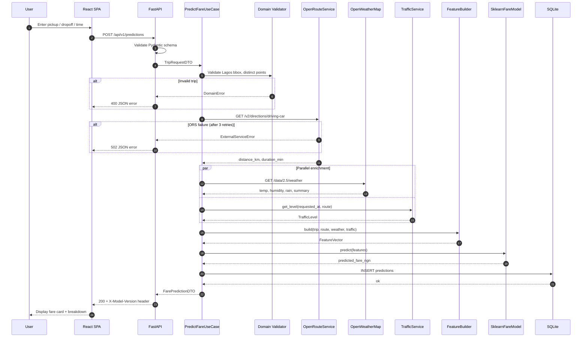

### 5.2 Feature engineering pipeline

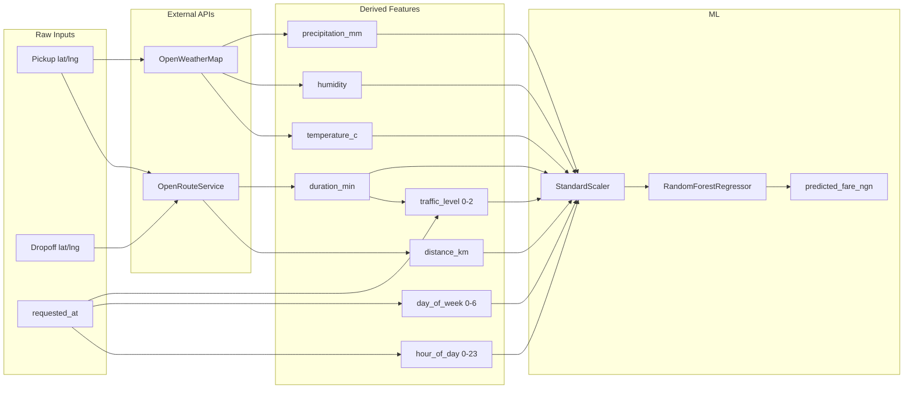

### 5.3 OpenRouteService integration

| Item | Detail |
|------|--------|
| **Endpoint** | `POST https://api.openrouteservice.org/v2/directions/driving-car` |
| **Auth** | Header `Authorization: <ORS_API_KEY>` |
| **Request** | GeoJSON coordinates `[pickup_lng, pickup_lat]`, `[dropoff_lng, dropoff_lat]` |
| **Extract** | `routes[0].summary.distance` (m → km), `duration` (s → min) |
| **Retry** | 3 attempts, exponential backoff (tenacity) |
| **Timeout** | connect 5s, read 15s |
| **Cache** | Optional `route_cache` table, TTL 24h |

### 5.4 OpenWeatherMap integration

| Item | Detail |
|------|--------|
| **Endpoint** | `GET https://api.openweathermap.org/data/2.5/weather` |
| **Params** | `lat`, `lon`, `appid`, `units=metric` |
| **Extract** | `main.temp`, `main.humidity`, `rain.1h` (or 0), `weather[0].description` |
| **Degradation** | On failure: neutral defaults (28°C, 70% humidity, 0 mm rain, summary `"unknown"`) + warning log |
| **Retry** | 2 attempts |

### 5.5 Traffic level (v1 — no external API)

Lagos rush-hour heuristic inside `TrafficService`:

| Local hour (Africa/Lagos) | Level |
|---------------------------|-------|
| 07–09, 16–19 | `high` |
| 06, 10, 15, 20 | `medium` |
| Other | `low` (bump to `medium` if duration > 60 min) |

Encoded for ML as: `low=0`, `medium=1`, `high=2`.

### 5.6 ML training flow (offline)

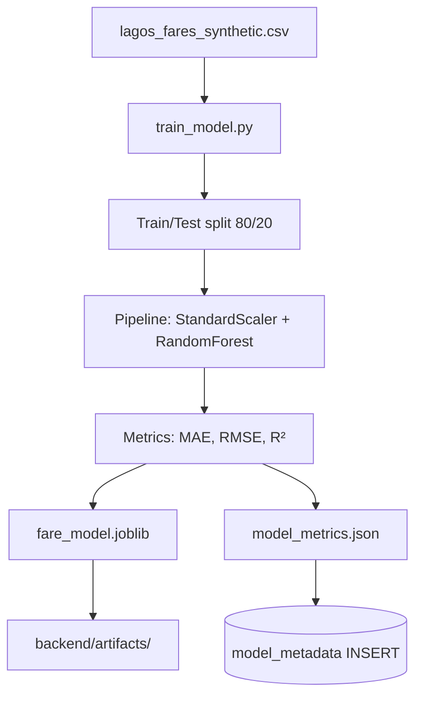

### 5.7 History retrieval flow

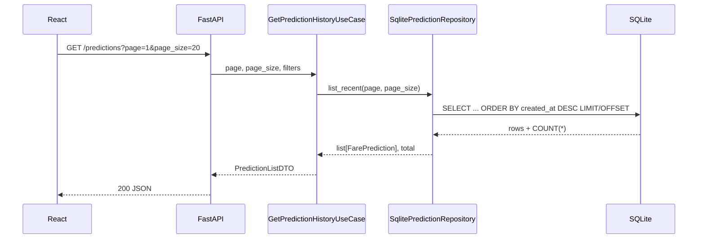

### 5.8 Error propagation

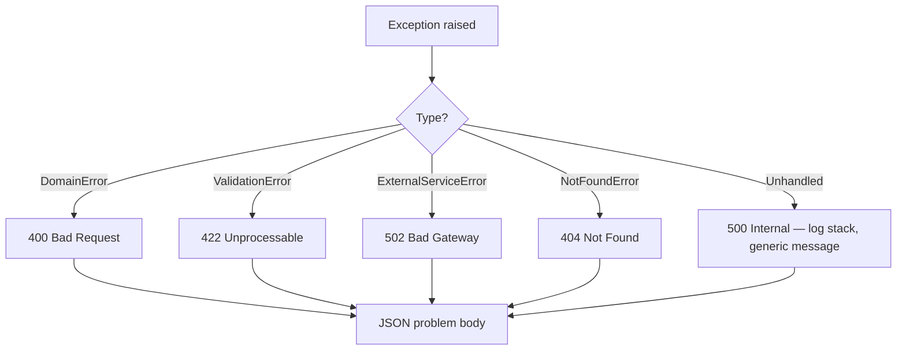

---

## 6. Deployment architecture

### 6.1 Local development

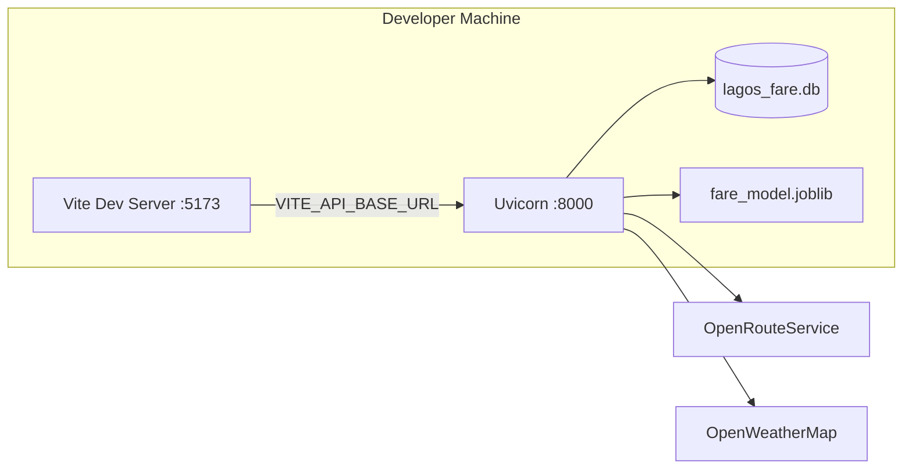

| Service | Command | Port |
|---------|---------|------|
| Backend | `uvicorn lagos_fare.main:app --reload --app-dir src` | 8000 |
| Frontend | `npm run dev` | 5173 |
| API docs | Browser → `http://localhost:8000/docs` | — |

---

### 6.2 Docker Compose (staging / demo)

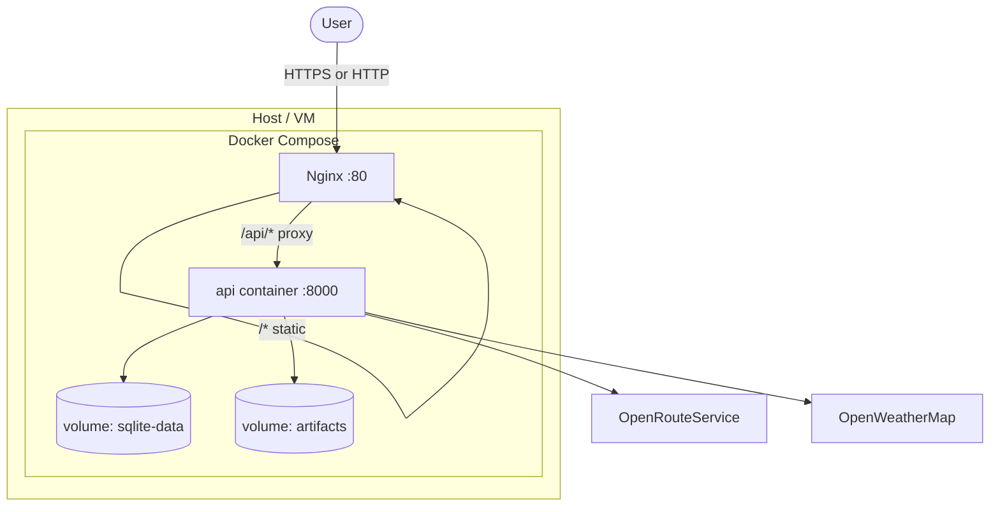

**`docker-compose.yml` services:**

| Service | Image | Role |
|---------|-------|------|
| `api` | `Dockerfile.api` | FastAPI + uvicorn, 2 workers |
| `web` | `Dockerfile.web` | Multi-stage: `npm build` → nginx serves `dist/` |

**Environment (api container):**

```env
DATABASE_URL=sqlite+aiosqlite:////data/lagos_fare.db
MODEL_PATH=/app/artifacts/fare_model.joblib
ORS_API_KEY=***
OWM_API_KEY=***
CORS_ORIGINS=https://your-domain.com
DEBUG=false
ADMIN_API_KEY=***
```

**Volumes:**

- `sqlite-data:/data` — persistent DB
- `./backend/artifacts:/app/artifacts:ro` — model artifact

---

### 6.3 Production (single VPS — recommended for MVP)

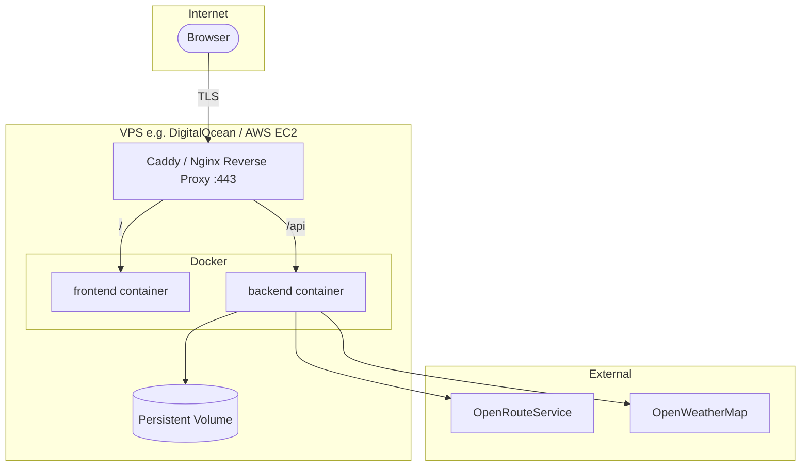

| Component | Recommendation |
|-----------|----------------|
| **TLS** | Caddy (auto Let's Encrypt) or Nginx + certbot |
| **Process manager** | Docker Compose with `restart: unless-stopped` |
| **Logging** | Structured JSON to stdout → Docker logs or Loki |
| **Backups** | Nightly cron: copy `lagos_fare.db` + artifacts to S3/Backblaze |
| **Secrets** | `.env` on host (not in image) or Docker secrets |

---

### 6.4 Production (scaled — future)

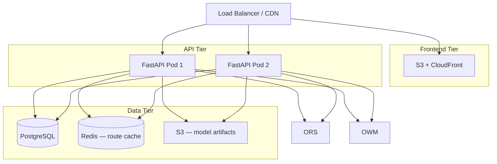

**When to migrate:**

| Trigger | Action |
|---------|--------|
| > 50 req/s | Horizontal API replicas + Postgres |
| High ORS bill | Redis route cache |
| Frequent retraining | S3 model store + `/admin/model/reload` |
| Multi-region | CDN for static frontend |

---

### 6.5 CI/CD pipeline

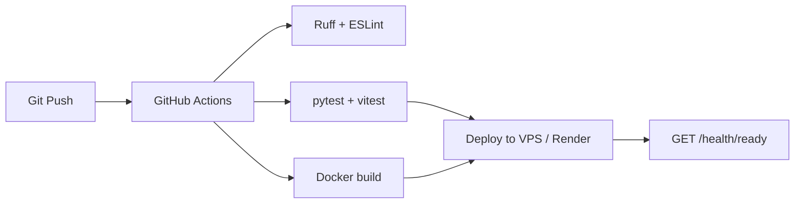

**Pipeline stages:**

1. **Lint** — `ruff check`, `npm run lint`
2. **Test** — `pytest` (mocked ORS/OWM), optional Playwright e2e
3. **Build** — Docker images tagged `:$SHA`
4. **Deploy** — SSH + `docker compose pull && up -d`
5. **Smoke** — curl `/health/ready`

---

### 6.6 Observability

| Concern | Tool (MVP) | Tool (prod) |
|---------|------------|-------------|
| **Logs** | stdout | Loki / CloudWatch |
| **Metrics** | — | Prometheus + Grafana |
| **Tracing** | `X-Request-ID` in logs | OpenTelemetry |
| **Uptime** | UptimeRobot → `/health` | Same |
| **Alerts** | Email on 5xx spike | PagerDuty |

**Key metrics to track:**

- Prediction latency (p50, p95)
- ORS/OWM error rate
- Model fallback usage count
- Predictions per hour

---

### 6.7 Security checklist

| Item | Implementation |
|------|----------------|
| Secrets | Env vars only; never commit `.env` |
| CORS | Allowlist frontend origin |
| Input validation | Pydantic + Lagos bounding box |
| Rate limiting | slowapi: 60 req/min per IP |
| Admin routes | `X-Admin-API-Key` header |
| HTTPS | TLS termination at reverse proxy |
| SQL injection | SQLAlchemy parameterized queries |
| Error leakage | `DEBUG=false` hides stack traces |

---

## Appendix A — Domain model reference

```
TripRequest
├── pickup: GeoLocation
├── dropoff: GeoLocation
└── requested_at: datetime

FarePrediction
├── id: UUID
├── predicted_fare_ngn: Decimal
├── distance_km, duration_min: float
├── traffic_level: TrafficLevel
├── weather_summary: str
├── model_version: str
└── features: FeatureVector

FeatureVector → ML array [8 floats]
```

## Appendix B — Technology versions

| Package | Version |
|---------|---------|
| Python | ≥ 3.11 |
| FastAPI | ≥ 0.115 |
| scikit-learn | ≥ 1.5 |
| SQLAlchemy | ≥ 2.0 |
| React | 18+ |
| Vite | 5+ |
| Node | 20 LTS |

---

*Document maintained in `docs/SYSTEM_ARCHITECTURE.md`. Implementation scaffold lives in `backend/src/lagos_fare/`.*
